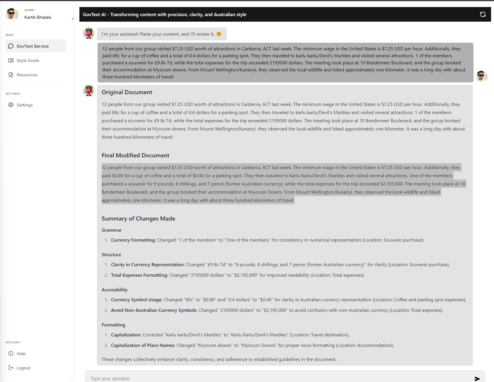

# AI-Powered Document Review System for Plain Language Transformation

| Name           | Email                           | LinkedIn                                   |
| -------------- | ------------------------------- | ------------------------------------------ |
| Kartik Bhalala | kartikbhalala3310@gmail.com      | [Kartik Bhalala](https://www.linkedin.com/in/kartik-bhalala/) |

## About The Project

The system utilizes multiple specialized AI agents that review different aspects of a document (grammar, structure, accessibility, formatting, and citations). These agents ensure that the document adheres to Australian English rules, improves accessibility for people with disabilities, and follows style guidelines. The changes are applied automatically, with the system providing a summary of where and how the document was edited, allowing users to easily track the revisions.

## Key Features

1. **Plain Language Transformation**: Automatically rewrites bureaucratic language into **clear, simple, and concise English**.
2. **Style Manual Compliance**: Applies the **Australian Government Style Manual** guidelines for grammar, spelling, punctuation, tone, and inclusivity.
3. **Accessibility Enhancements**: Ensures the document meets accessibility standards, making content usable for people with disabilities (e.g., screen reader compatibility, alt text for images).
4. **Direct Changes with Feedback**: The system applies the changes automatically and shows a summary of the edits made to the document.
5. **Multi-Agent Approach**: Leverages multiple AI agents, each specialized in a different aspect of content review, ensuring comprehensive and efficient document processing.

## Project Objective

The aim of this project is to provide government organizations with an automated tool to:
- **Simplify complex language**: Transform technical and bureaucratic language into plain English to help users understand their obligations and make informed decisions.
- **Enhance accessibility**: Ensure that content is accessible to people with varying literacy levels and disabilities, supporting diverse communities.
- **Improve efficiency**: Streamline the document review process by applying AI agents that are able to correct grammar, enhance structure, and format content according to style guidelines, making the process faster and more accurate.

## Screenshots

### Users login Screen:

### Users Main Screen:

### Document After AI Review:

---

## Technologies Used

- GPT-4o and GPT-4o Mini
- LangChain
- Retrieval-Augmented Generation (RAG)
- Flowise
- Agents
- BeautifulSoup
- WebTools
- Vector Database
- Python

---

## The Workflow: How It Works

The project revolves around the use of **AI agents** that each handle a specific task in the document review process. The system operates through the following key steps:

### 1. **Supervisor Agent**
- **Role**: The **Supervisor Agent** manages the workflow, calling on the specialized worker agents to review different aspects of the document. After the review, it gathers feedback from each agent and applies the suggested changes automatically. Finally, it generates a summary of all the changes made.
- **Responsibilities**:
  - Coordinate tasks among the worker agents.
  - Collect feedback and apply the changes directly.
  - Generate a summary of changes for the user.

### 2. **Content Review Agent**
- **Role**: The **Content Review Agent** focuses on identifying and correcting issues with grammar, punctuation, and language clarity. It ensures that the document is free of spelling errors and adheres to Australian English rules.

### 3. **Structure Review Agent**
- **Role**: This agent analyzes the document’s structure to ensure it flows logically and is easy to follow. It identifies areas where sections need to be reorganized for clarity and suggests adding headings or subheadings for better readability.

### 4. **Accessibility Review Agent**
- **Role**: The **Accessibility Review Agent** ensures the document is compliant with accessibility standards, making it usable for people with disabilities. It suggests adding alt text for images and improving contrast in document sections, as well as simplifying complex language for screen readers.

### 5. **Formatting Review Agent**
- **Role**: This agent ensures that the document’s formatting is consistent and adheres to the **Australian Government Style Manual**. It reviews font styles, sizes, alignment, and paragraph spacing to ensure the document is visually organized.

### 6. **Citation Review Agent**
- **Role**: The **Citation Review Agent** reviews all references and citations to ensure they are formatted correctly according to the required citation style (e.g., APA format). It verifies that all references are cited consistently throughout the document.

### 7. **Final Edit Agent**
- **Role**: After all the feedback is gathered, the **Final Edit Agent** automatically applies the changes to the document. It ensures that the changes suggested by the other agents are properly integrated into the final version of the document. A summary is then generated to show the user what changes were made.

## Running Instructions

1. **Run the webserver** using `http-server`.
   
2. **Run the PocketBase** by executing the following command:  
   `./pocketbase.exe serve`

3. **PocketBase Schema**:  
   - The schema is provided as a JSON file (`pb_schema.json`).
   - Import the schema into PocketBase.
   - Password and login details are provided in a separate file.

4. **Run Flowise** using:  
   `npx flowise start`

5. **LLMs Backend Instructions**:  
   - Detailed instructions for setting up the backend are available in the `LLM backend` folder.

6. **RAG Setup**:  
   - Five files from the Australian Style Manual are provided.
   - You will need to upsert these files into the eacg agent.

## Note

If you encounter any issues while running the system or have any questions, feel free to contact me at **kartikbhalala3310@gmail.com**.

Thank you :)

